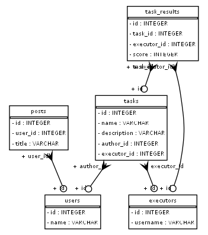

# Marketplace FreeLance

Система управления заказами на площадке для фриланса на FastAPI с использованием асинхронной SQLAlchemy и SQLite. Поддерживает регистрацию пользователей, создание задач, назначение исполнителей и выставление оценок, реализован алгоритм подбора исполнителя.

---

## Установка и запуск

### 1. Клонирование репозитория

```bash
git clone https://github.com/your-username/your-repo-name.git
cd your-repo-name
```

### 2. Создание и активация виртуального окружения
```bash
Копировать
Редактировать
python -m venv venv
source venv/bin/activate  # для Linux/macOS
venv\Scripts\activate     # для Windows
```
### 3. Установка зависимостей
``` bash
Копировать
Редактировать
pip install -r requirements.txt
```

### 4. Запуск сервера
```bash
uvicorn main:app --reload
```
### Документация API
Swagger UI: http://localhost:8000/docs

Redoc: http://localhost:8000/redoc


### Сценарии тестирования (Postman)
Используйте Postman или curl для тестирования API.

1. Регистрация пользователя
POST /users/register

```json
{
  "username": "testuser",
  "password": "testpass"
}
```
### 2. Авторизация и получение токена
POST /users/login

```json
{
  "username": "testuser",
  "password": "testpass"
}
```
 Ответ содержит JWT access_token, который нужно использовать в Authorization: Bearer <token>.

### 3. Создание задачи
POST /tasks

```json

{
  "name": "Сделать отчет",
  "description": "Финансовый отчет за квартал",
  "author_id": 1
}
```
### 4. Создание исполнителя
POST /executors

```json

{
  "username": "executor1"
}
```
### 5. Назначение исполнителя вручную
PUT /tasks/1/assign?executor_id=1

### 6. Назначение исполнителя автоматически (жадный алгоритм)
POST /tasks/1/assign-greedy

### 7. Завершение задачи и выставление оценки
POST /tasks/1/close

```json
{
  "executor_id": 1,
  "score": 8
}
```
### 8. Защищённый маршрут
GET /users/protected

Необходим токен: Authorization: Bearer <access_token>

### ER-диаграмма 


### API - эндпоинты

```bash
tasks:
/task get Получение всех задач
/tasks post Добавление задачи
/tasks/{task_id}/name Обновление задачи
/tasks/{task_id}/close Закрытие задачи
/tasks/{task_id}/close Ручное назначение задачи
/tasks/{task_id}/assign-greedy Автоматизированное назначение задачи

/users/register Регистрация
/users/register Получение токена
/users/protected Авторизация по токену
/users/delete Удаление пользователя с проверкой по токену
/users Получение пользователей

/executors post Создание исполнителя
/executors get Получение исполнителей, их задач и среднюю оценку
```

### Структура проекта
```bash
├── main.py               # Точка входа в приложение
├── database.py           # ORM модели и инициализация БД
├── repository.py         # Логика работы с данными
├── router.py             # API-роуты
├── schemas.py            # Pydantic-схемы
├── config.py             # Конфигурация
├── requirements.txt
└── README.md
```
### Стек технологий
FastAPI — фреймворк для API

SQLAlchemy (async) — ORM

SQLite —  встроенная БД

JWT (OAuth2) — авторизация
